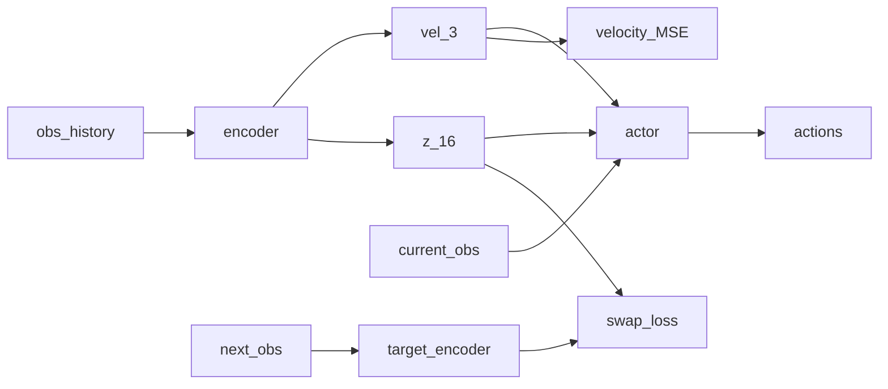

# 强化学习与 HimLoco 讲座（100 分钟）

对着本仓库讲。行号以当前打开的文件为准。学生现场跟着看代码，不需要其它材料。

dog 任务实际用的是 `legged_gym/envs/dog/dog_config.py` 对默认配置的覆盖。讲参数时先看默认，再点一下 dog 改了什么。

## 时间

| 时间 | 内容 | 打开的文件 |
|------|------|------------|
| 0–12 | 白话 RL、四个词、观测里有什么 | 本讲义；`legged_robot.py` 295 行 |
| 12–32 | 原始 PPO | `him_on_policy_runner.py`、`ppo.py`、`actor_critic.py` |
| 32–45 | HIM 多了什么 | `him_actor_critic.py`、`him_estimator.py`、`him_ppo.py` |
| 45–55 | 仓库结构 | 资源管理器 |
| 55–75 | 一步训练链路 | `train.py`、`legged_robot.py` |
| 75–100 | 配置每个参数 | `legged_robot_config.py`，对照 `dog_config.py` |

---

## 0–12 分：强化学习白话 + 落到这只狗

这一段不进损失公式，也不打开估计器。先讲清楚「强化学习在干什么」，再把四个词落到仓库里的具体函数。

### 强化学习白话

监督学习像对着标准答案做题：输入一张图，标签写「这是猫」，网络学着把输出凑到标签上。强化学习没有这种一步一步的标准答案。你只告诉机器人：做得好就加分，做得差就扣分。它得自己试。

可以想成教一只狗站起来走路：

1. 狗看见现在身体怎样（观测）。
2. 它试着动一下关节（动作）。
3. 世界往前走一小步，你给它一个分数（奖励）：跟得上速度就加分，摔倒、乱晃就扣分。
4. 试了很多次之后，把「哪种动法总分高」记进网络（策略更新）。

关键点有四个，后面代码全围着它们转：

- **没有逐步示范。** 你不会写「第 3 秒髋关节应该是 0.8 弧度」。你只写评分规则。
- **分数常常延迟。** 这一拍动作好不好，往往要过几拍才看出来。所以网络要学「现在这一步，对后面一长串分数有没有帮助」，不只看眼前那一分。
- **要探索。** 一开始网络是瞎试。如果永远只走已经试过的动作，就学不到更好的步态。后面 PPO 里的「熵」就是在鼓励别太早钉死一种走法。
- **策略是一张表，用网络来存。** 观测进、动作出。训练改的是网络权重；部署时只做前向，不再改权重。

和「模仿人类方向盘」不一样：这里没有人类示范轨迹当标签，标签就是你写的奖励函数。奖励写歪了，策略就会学会歪的行为——比如力矩惩罚太大，狗会不敢出力，速度永远跟不上。

仿真里可以同时放几千只狗一起试（dog 是 2048）。经验来得快，但仿真和真机总有差距：质量、摩擦、延迟都不一样。所以训练时会故意随机这些量（域随机化），让策略别死记仿真里的某一种物理参数。

### 训练在这只狗上长什么样

每一拍：看见一组数 → 网络吐出关节命令 → 仿真往前推 → 给一个分数。过一段时间，用这些分数改网络。然后重复。

| 词 | 这一拍在问什么 | 代码 |
|----|----------------|------|
| 观测 | 现在看见什么 | `LeggedRobot.compute_observations`，`legged_robot.py` 295 行 |
| 动作 | 关节命令是什么 | 进入 `_compute_torques`，578 行，变成力矩 |
| 奖励 | 这一拍好不好 | `compute_reward`，275 行 |
| 策略更新 | 网络该往哪改 | `HIMPPO.update`，`him_ppo.py` 146 行 |

一次更新用的是成千上万步，不是一只狗走一步。现在只要记住：先采一段，再改一次网络。采集循环放到下一节打开。

### 名字看输入输出，不看层数

Actor、Critic、Encoder 用的网络结构基本都是多层全连接（MLP）。叫什么名字，取决于输出拿去干什么，不取决于有几层、用不用卷积。

对着本仓库说：

- **Actor**：历史观测进去，16 维关节命令出来。狗有 4 条腿，每条 3 个腿关节加 1 个轮，所以是 16，不是常见四足的 12。
- **Critic**：训练时看更多信息，输出一个标量，表示「从这一拍往后大概还能拿多少分」。它不直接出动作。部署时可以不要它。
- **Encoder / 估计器**：把过去若干帧压成短向量，再喂给 Actor。HIM 的具体算法放到 32 分以后，这里只建立「输出会再进 Actor」。

顺手去掉几个容易混的词：

- **隐向量**：观测里看不到、但网络认为有用的内部表示。速度有物理单位（m/s），隐向量没有。前者叫显式估计，后者叫隐式。
- **解码器**：从隐向量再变回观测或图像。本仓库的 HIM 不走这条，对比放在 HIM 那一节。
- **奖励 vs 损失**：奖励是环境给策略的分（跟得上速度就高）。损失是训练程序用来改网络的量（预测偏了就大）。两者不是同一个数。你一边在环境里打分，一边在算法里用损失推梯度。

### 狗这一拍看见什么

打开 `legged_robot.py` 315–321 行。策略可见的一帧按这个顺序拼：

| 段 | 维数 | 从哪来 |
|----|------|--------|
| 机身角速度 | 3 | IMU 能给 |
| 重力在机身坐标系的投影 | 3 | 由姿态算出，告诉狗哪边是下 |
| 速度指令 | 3 | 人给的 vx、vy、偏航，不是传感器 |
| 关节角误差 | 16 | 相对站立默认角；轮子被置 0（311–312 行），轮没有「该停在哪个角度」 |
| 关节速度 | 16 | 编码器 |
| 上一拍动作 | 16 | 网络自己上次的输出 |

3+3+3+16+16+16 = 57，和 `dog_config.py` 8 行一致。典型四足还会用关节角、关节速度、重力投影；这里额外加了角速度、指令和上一拍动作。

指令必须进观测，否则网络不知道这一拍该往哪走。只有输入、没有对应奖励，网络也会忽视命令——本仓库里和指令配对的主奖励就是速度跟踪。

### 为什么要看好几帧

单看这一帧不够。关节角、IMU、上一拍动作都一样时，狗却可能站在水泥、沙地或碎石上，一帧分不出地面。看历史才看得出：腿按平地的方式在动，关节却突然走不动，那就是碰到了台阶。

代码把最近 6 帧接成策略输入。`dog_config.py` 9 行：`num_observations = 57 * 6 = 342`。写入在 `legged_robot.py` 340 行，新的一帧放在最前面，丢掉最旧的一帧。Actor 真正吃进去的不是这 342 维原样，那是 HIM 相对原始 PPO 的改动，下一节再讲。

### 仿真能看、真机不能看

327 行之后又拼上线速度、外力、脚下高度、足端接触力。这些叫**特权信息**：仿真器里免费有，真机上贵、噪、或者根本没有。

训练时的常见做法是：Critic 开卷（可以看特权量），Actor 闭卷（只能用真机能算的量）。部署时只留下 Actor。这样价值估得准一些，上真机又不依赖仿真才有的量。

线速度特别重要，但真机上不能靠 IMU 加速度积分——积分会漂，时间一长误差累上去。而运动控制对速度很敏感，因为主奖励就是速度跟踪。仿真里的 `base_lin_vel` 是真值，所以训练时可以拿它当老师，不能把它直接塞进要上真机的 Actor。HIM 后面会专门学「从历史估一个速度」，就是为了补这个缺口。

### 主奖励是跟速度

奖励不是只有一项。站直、别蹦、力矩别太大，都是附加项。速度跟踪通常比其它项大一个数量级。dog 里 `tracking_lin_vel = 3.0`（`dog_config.py` 95 行），姿态、力矩等多是零点几或更小的负数。跟不上指令，其它项做得再好，总分仍然差。指令课程和地形课程后面会看到，门槛也都是按「速度跟得怎么样」来卡的。

到这里可以停。下一节打开 PPO：采完一段之后，分数具体怎么变成一次网络更新。

---

## 12–32 分：原始 PPO

本仓库默认不跑原始 PPO。`task_registry.py` 约 147 行直接构造 `HIMOnPolicyRunner`。但 HIM 的策略损失和原始 PPO 相同，所以先对着原始实现讲清三件事，再看 HIM 的循环只是套了同一套。

### 为什么先讲 PPO

强化学习里「采一段经验 → 算每一步值不值得 → 改网络」是通用骨架。PPO（Proximal Policy Optimization）是其中一种稳一点的改法：每次只允许策略挪一小步，避免一次更新把好不容易学会的步态冲垮。

现场对照可以打开两套文件，但默认训练只走 HIM 那套：

- 循环：`him_on_policy_runner.py`（实际在跑）
- 损失公式：`ppo.py`（逻辑相同，HIM 多两个估计器损失）

### 一轮迭代长什么样

打开 `rsl_rl/rsl_rl/runners/him_on_policy_runner.py`，`learn` 在 103 行。注释写明顺序与原始 PPO 相同。外层循环在 129 行，每轮做完采集才更新一次。

1. **采集**，134–147 行。`act` 出动作，`env.step` 推进一步，`process_env_step` 存进缓冲区。`num_steps_per_env` 步之后才更新一次（dog 是 48，见 `dog_config.py` 139 行）。这 48 步里网络权重不动，只是在「用当前策略试」。
2. **算回报**，166 行 `compute_returns`。用 GAE（Generalized Advantage Estimation）：这一步比 Critic 预期好多少叫优势。远处的奖励按 `gamma` 打折（越远越不值钱），`lam` 决定优势估得有多「看远期」。优势 > 0：比预期好，这种动作该多出；优势 < 0：该少出。
3. **更新**，168 行 `update`。HIM 这里多返回两个估计器损失。原始 PPO 的 `OnPolicyRunner.learn`（`on_policy_runner.py` 91 行）只返回价值损失和策略损失。

144–145 行：若这一步终止，用终止前的特权观测替换下一步 Critic 观测。摔倒后的重置状态不能当成「摔倒那一拍的下一状态」——否则价值函数会学到「摔倒之后立刻站在出生点」这种假因果。

采集时用了 `torch.inference_mode`（132 行）：出动作不算梯度，省显存。梯度只在 `update` 里算。

### 策略损失三件事

打开 `rsl_rl/rsl_rl/algorithms/ppo.py`，`update` 在 130 行。每个 mini-batch 重复下面三件事。

- **策略损失（surrogate）**，169–174 行。新策略给「当时那个动作」的概率，除以旧策略的概率，得到 ratio。ratio 再乘优势。意思是：好动作（优势为正）就希望新策略更常出它，坏动作就更少出。ratio 被夹在 `1±clip_param`（默认 0.2，大约 0.8–1.2），防止一步改太猛——这就是 PPO 名字里 proximal（别走太远）的含义。
- **价值损失**，176–184 行。Critic 预测的价值贴近刚才算好的回报。预测偏了，优势也就偏了，策略更新会跟着歪。`use_clipped_value_loss` 时价值也裁剪，避免 Critic 一步跳太远。
- **熵**，186 行。`loss = surrogate + value_coef * value - entropy_coef * entropy`。熵项是减号，所以熵越大损失越小，用来鼓励探索：动作分布别太尖，别过早只走一种步态。dog 把 `entropy_coef` 降到 0.005，探索比默认弱一点。

KL 自适应学习率在 153–166 行：新旧策略差太多就减小学习率，差太小就加大。这不是第三种损失，只是调步长。`desired_kl` 默认 0.01。

同一批 rollout 会重复学 `num_learning_epochs` 遍，再切成 `num_mini_batches` 小批（默认 5 轮 × 4 小批）。数据用完就丢，这叫 on-policy：策略一改，旧数据就不能再用了，所以要重新采集。

### Actor 直接吃观测

打开 `rsl_rl/rsl_rl/modules/actor_critic.py`。`update_distribution` 在 129 行：整段观测直接进 MLP，得到动作均值，外面套固定可学习的标准差，再变成高斯分布去采样。没有估计速度，也没有隐向量。

Critic 的 `evaluate` 吃特权观测，输出一个标量。训练时 Critic 开卷，Actor 闭卷。这就是非对称 Actor–Critic，原始 PPO 已经如此。HIM 没有改 Critic 的输入方式，改的是 Actor 前面多了一层估计。

现场可以停一下问：如果 Actor 也直接吃仿真线速度，训练会很快，但上真机没有这个量——策略会塌。所以后面 HIM 要学「从历史估速度」。

---

## 32–45 分：HIM 比 PPO 多了什么

不重讲采集和策略损失。HIM 的策略更新仍是裁剪优势、价值损失和熵。多的是动作前面的一个估计器，以及估计器自己的两路损失。

### 要解决什么问题

上一节的 Actor 如果直接吃整段堆叠观测，维数大，而且没有明确告诉网络「你先搞清楚自己在以多快的速度走、地面大概是什么样」。HIM 的做法是：先从历史里挤出两样东西——估计速度（3 维）和一个隐向量（16 维）——再和当前这一帧拼起来给 Actor。

直觉上：地形、摩擦、外力这些难以直接观测的东西，统一看成扰动；不强迫网络显式报出「摩擦系数是多少」，而是学「扰动作用到机器人之后，机器人表现出了什么响应」，再据此控制。另一种常见做法是把隐向量解码成下一帧观测；HIM 不重建观测，而是让「历史编码出来的隐向量」和「下一帧目标编码出来的隐向量」互相对齐、互相分类。

### Actor 输入变了

打开 `rsl_rl/rsl_rl/modules/him_actor_critic.py`。

118 行：`mlp_input_dim_a = num_one_step_obs + 3 + 16`。狗的单步观测是 57，所以 Actor 输入是 76，不是堆叠后的 342。历史 342 维只进估计器，不整段灌进 Actor MLP。

`update_distribution` 在 190 行：

- 196 行起，`torch.no_grad` 下估计器读历史，给出速度 3 维和隐向量 16 维。出动作时不把策略梯度传进估计器——估计器另有自己的更新。
- 199 行把当前一帧、速度、隐向量拼起来再进 Actor。

对比 `actor_critic.py` 135 行：原始 Actor 是 `self.actor(observations)`，观测原样进去。

### 两路损失

打开 `rsl_rl/rsl_rl/modules/him_estimator.py`，`update` 在 101 行。

- **速度 MSE**，150 行 `estimation_loss`。标签是特权观测里的真实线速度（120 行附近切片），不是 IMU 积分。主奖励盯的是速度，估不准速度，Actor 等于在瞎跟指令。
- **swap**，149 行。历史编码器给出 `z_s`，目标编码器吃下一帧观测给出 `z_t`。两边和 32 个原型比较，用 Sinkhorn 得到软分类，让对方去预测这个分类。直观理解：两种看法（「从历史猜环境」和「从下一状态看环境」）应该把样本分到同一类里。这不是把隐向量解码成下一帧观测——没有观测重建项。

估计器有自己的 Adam（类里 `self.optimizer`）。部署时目标编码器和原型丢掉，只留历史编码器和 Actor——真机没有「下一帧特权观测」可喂目标编码器。

### 调用点

打开 `rsl_rl/rsl_rl/algorithms/him_ppo.py`，`update` 在 146 行。189 行先 `estimator.update`，191 行之后才是和 `ppo.py` 一样的 surrogate、value、entropy。估计器损失不进 209 行那个 `loss`，它在 `estimator.update` 内部已经反向并 `step`。策略优化器只更新 Actor/Critic；估计器用另一套参数。

现场对照记三句话：

1. 采集循环和原始 PPO 一样。
2. Actor 输入从「整段观测」变成「当前帧 + 估速 + 隐向量」。
3. 多两个损失，且不改 PPO 那三项的公式。

---

## 45–55 分：仓库每个目录

先让学生在资源管理器里从上到下指一遍。训练时真正热的路径只有 `legged_gym` + `rsl_rl`；部署和试跑另说。

| 路径 | 干什么 |
|------|--------|
| `legged_gym/` | 训练环境和启动脚本 |
| `legged_gym/scripts/train.py` | 训练入口，40–45 行：建环境、建 runner、`learn` |
| `legged_gym/scripts/play.py` | 回放并导出策略 |
| `legged_gym/envs/base/` | 通用腿式环境：`legged_robot.py` 逻辑，`legged_robot_config.py` 默认参数 |
| `legged_gym/envs/dog/` | 本机狗：`dog_config.py` 覆盖参数，`dog_robot.py` 几乎是空壳 |
| `legged_gym/envs/go2w/` | Go2W 变体，同样继承基类 |
| `legged_gym/utils/` | 任务注册、地形生成、命令行、导出 `policy.pt` |
| `rsl_rl/` | 算法。默认用 `runners/him_on_policy_runner.py`、`algorithms/him_ppo.py`、`modules/him_actor_critic.py` |
| `rsl_rl/.../ppo.py` 与 `actor_critic.py` | 原始 PPO，对照用，默认不跑 |
| `resources/robots/` | URDF 和网格 |
| `dog_ws/` | ROS2 部署：加载导出的策略，拼和训练一致的观测 |
| `mujoco/` | 不经 ROS 的独立试跑 |

补充几句，避免迷路：

- **改奖励、观测、力矩**：去 `legged_gym/envs/base/legged_robot.py`，参数默认值在同目录 `legged_robot_config.py`，dog 覆盖在 `envs/dog/dog_config.py`。
- **改网络结构、PPO 超参**：`dog_config.py` 里的 `DogRoughCfgPPO`，真正实现落在 `rsl_rl`。
- **换任务名**：`legged_gym/envs/__init__.py` 注册；命令行 `--task dog`。`cheetah` 是 dog 的别名。
- **导出上真机**：`play.py` / `utils/helpers.py` 里的导出，得到 `policy.pt`，再进 `dog_ws`。观测拼接必须和训练时一致，维数错一个就会乱走。

一句话：`legged_gym` 负责「狗在仿真里怎么动、怎么得分」，`rsl_rl` 负责「怎么根据得分改网络」。

---

## 55–75 分：用 `step` 顺训练链路

从 `legged_gym/scripts/train.py` 40–45 行进入。`make_env` 建 `LeggedRobot`，`make_alg_runner` 建 `HIMOnPolicyRunner`，然后 `learn`。`learn` 里每一次 `env.step` 就是下面这条链。文件是 `legged_gym/envs/base/legged_robot.py`。

现场按编号往下翻，不要在奖励函数里逐个展开。

1. **`step`，118 行。** 裁剪动作。若开启延迟（`domain_rand.delay`），把这一拍动作展开成 `decimation` 个子步（136–141 行）：物理比策略快，一个策略命令要管好几拍仿真；延迟打开时，子步之间从上一拍动作插值到这一拍，模拟真机执行滞后。
2. **子步循环，144 行。** 每个子步调用 `_compute_torques`（578 行）：腿是位置 PD（目标角 = 默认角 + `action_scale * action`），轮是速度目标（`vel_scale`、`wheel_direction` 在 dog 配置里）。力矩写入 PhysX 再 `simulate`。策略频率 ≈ `1 / (decimation * sim.dt)`；dog 默认 4 × 0.005 s → 约 50 Hz。
3. **`post_physics_step`，160 行。** 刷新机身速度、姿态、足端接触等，从仿真张量拉回 PyTorch。
4. **`_post_physics_step_callback`，530 行。** 到点换速度指令、测地形高度、偶尔推一把或加外力。这些发生在打分之前——你先改世界，再按新世界打分。
5. **`check_termination`，205 行。** 机身触地或回合超时则要重置。超时记在 `time_out_buf`，不当成摔倒惩罚（超时是时间到了，不是失败）；摔倒才是真正的失败终止。
6. **`compute_reward`，275 行。** 把所有非零 scale 的 `_reward_*` 加起来。必须在重置之前算，否则打的是重生后的分数，因果全乱。
7. **`reset_idx`，215 行。** 只处理要重置的环境：地形课程（升行/降行、解锁新列）、关节和机身复位、新指令。活着的环境不换格子。课程改的是「这只狗下次出生在哪一块地形」，不会当场重建整张地图。
8. **`compute_observations`，295 行。** 拼当前帧，再塞进历史队列。Actor 用的历史在这里形成；Critic 的特权量也在这里接上。
9. **返回。** 观测、特权观测、奖励、是否结束，外加终止相关量。回到 `learn` 134–147 行存起来。采满 `num_steps_per_env` 后才 `compute_returns` 和 `update`。

奖励函数从 1348 行起，现场不必逐个进。权重在配置的 `rewards.scales`，非零才会被 `_prepare_reward_function`（894 行）挂上，并乘以 `dt`——这样改仿真步长时，每秒累计奖励尺度大致不变。

和前面 PPO 节对上：`learn` 里的 `env.step` = 上面 1–9；`process_env_step` 只是把返回值放进 rollout 缓冲区；真正改网络仍在采满之后。

---

## 75–100 分：配置参数如何影响训练

文件：`legged_gym/envs/base/legged_robot_config.py`。dog 的覆盖在 `legged_gym/envs/dog/dog_config.py`。改默认文件对 dog 无效，除非 dog 没有覆盖该项。

讲的时候按类跳。每一项只说「动它训练会怎样」。

### `env`（51 行）

dog 覆盖：2048 个环境、单步观测 57、动作 16（`dog_config.py` 6–12 行）。

| 行 | 参数 | 影响 |
|----|------|------|
| 53 | `num_envs` | 越大每轮样本越多、越吃显存。太小方差大，学得抖。 |
| 56 | `num_one_step_observations` | 必须和 `compute_observations` 拼出来的一帧维数一致，否则网络对不上。 |
| 58 | `num_observations` | 历史帧数 = 该项 / 单步维数。帧越多，估计器能看的历史越长，输入也越大。 |
| 61 | `num_one_step_privileged_obs` | Critic 和估计器监督用的特权维数。少了线速度，速度 MSE 的标签就切错。 |
| 64 | `num_privileged_obs` | 特权历史长度。当前是 1 帧。加长则 Critic 输入变宽。 |
| 65 | `num_actions` | 必须等于可控关节数。dog 为 16。错了力矩和观测都会错位。 |
| 66 | `env_spacing` | 只影响平面网格摆放。trimesh 时不用。 |
| 67 | `send_timeouts` | 关掉后，超时不再把价值加回奖励，回合会被当成真终止，价值估计偏悲观。 |
| 68 | `episode_length_s` | 回合更长，能看更远的速度跟踪，也更晚重置、课程更新更稀。 |

### `terrain`（70 行）

dog 覆盖（`dog_config.py` 14–30 行）：摩擦 0.8、9 列、类型 0–8、初始只在第 0 行第 0 列。跟踪门槛 0.82，达标占比 0.6，存活率 0.7，卡住保底改为 12 个回合、存活率 0.5。`difficulty` 仍用默认 -1，走结构化列课程。表里是默认值，现场讲 dog 时以覆盖为准。

| 行 | 参数 | 影响 |
|----|------|------|
| 72 | `mesh_type` | `plane` 没有地形课程。`trimesh`/`heightfield` 才生成高度图。 |
| 73 | `horizontal_scale` | 格子更大则地形更糙、更省，细节（台阶）更糊。 |
| 74 | `vertical_scale` | 高度量化更粗，小起伏被抹平或变成台阶感。 |
| 75 | `border_size` | 地图外圈。太小可能测高越界。 |
| 76 | `curriculum` | 关掉则一开始就在各难度行上，容易早期摔倒学崩。 |
| 77–78 | 静/动摩擦 | 地形默认摩擦。域随机化打开时，每个环境还会再随机。 |
| 79 | `restitution` | 越大越弹，接触奖励和站稳更难。 |
| 81 | `measure_heights` | 关掉则没有高度扫描，特权观测和 `base_height` 奖励都变。 |
| 83–84 | `measured_points_x/y` | 扫描范围。点数必须和特权观测里的 187 对上，否则维数错。 |
| 85–86 | `selected` / `terrain_kwargs` | 只生成一种地形，用来调试某一类障碍，不用于正常课程。 |
| 87 | `max_init_terrain_level` | 开训时最难落到第几行。dog 设成 0，只从最易行开始。改大则开局更难。 |
| 88–89 | `terrain_length/width` | 一块格子多大。升行判定里「走出半块地」用的就是这个长度。 |
| 90 | `num_rows` | 同一类地形里的难度档数。越多，行与行之间的坡度/台阶差越小。 |
| 91 | `num_cols` | 地形种类数。dog 改成 9，对应 0–8。 |
| 93 | `terrain_proportions` | 只对旧版随机地形有效。dog 用结构化类型后，这项不决定列的种类。 |
| 97 | `difficulty` | ≥0 时改成「平地列 + 复杂列」混合，不再按 0–8 列解锁。默认 -1 不要改，除非故意换课程模式。 |
| 98 | `max_rough_terrain_ratio` | 只在 `difficulty≥0` 时限制复杂地形列占比。 |
| 100 | `curriculum_start_type_col` | 开训开放到第几列。改大等于跳过平地。 |
| 101 | `curriculum_type_unlock_step` | 每次解锁加几列。改大则难度跳得猛。 |
| 102 | `command_tracking_pass_threshold` | 单环境升行的跟踪门槛。越高越难升级。 |
| 103 | `command_tracking_success_ratio` | 一批重置里达标占比。越高，解锁新列越慢。 |
| 104 | `curriculum_min_timeout_ratio` | 存活率门槛。摔倒太多就不会解锁新列。 |
| 105 | `curriculum_unlock_interval_episodes` | 两次解锁的最短间隔。改大则课程更慢。 |
| 107–109 | `curriculum_force_unlock_*` | 卡住时的保底解锁。放宽会在还没学稳时进入更难地形。 |
| 111 | `slope_treshold` | 过陡的三角面被拉成竖直面。影响楼梯和陡坡的碰撞形状，不直接进奖励。 |

### `commands`（113 行）

dog 覆盖（`dog_config.py` 32–45 行）：`max_curriculum=2.5`，门槛 0.82，步长 0.15，`lin_vel_x` 仍是 `[-2, 2]`，偏航角速度收成 `[-1, 1]`。

| 行 | 参数 | 影响 |
|----|------|------|
| 115 | `curriculum` | 关掉则速度指令范围永远是 `ranges` 里的初值。 |
| 116 | `max_curriculum` | 前向速度指令最终能放到多大。太大则后期任务过难。 |
| 118 | `num_commands` | 指令维数。观测里只用前 3 维（vx, vy, yaw）。改维数要改观测拼接。 |
| 119 | `resampling_time` | 多久换一次指令。太短学不会跟踪，太长只适应单一速度。 |
| 120 | `heading_command` | 开：给目标朝向，代码再算 yaw 指令。关：直接采样 yaw 角速度。 |
| 122 | `curriculum_pass_threshold` | 高低速两组都超过该跟踪比例才放宽 vx。越高，指令变难越慢。 |
| 123 | `curriculum_step` | 每次把 vx 范围加减多少。越大跳得越猛。 |
| 127–130 | `ranges.*` | 采样上下限。课程只改 `lin_vel_x`。vy、yaw、heading 一直用这里的范围。 |

### `init_state`（132 行）

dog 把初始高度改成 0.45，并写了 16 个关节的默认角（`dog_config.py` 47 行起）。

| 行 | 参数 | 影响 |
|----|------|------|
| 134 | `pos` | 出生高度。太低会插进地面，太高会摔。z 要和站立高度接近。 |
| 135 | `rot` | 初始姿态。不要改，除非故意从歪的姿态学起。 |
| 136–137 | `lin_vel` / `ang_vel` | 配置里的初速度；重置时代码还会再加一小段随机速度。 |
| 139 | `default_joint_angles` | action=0 时的站姿。键必须对上 URDF 关节名。错一个，PD 目标就错，狗站不起来。 |

### `control`（143 行）

dog 另有 `vel_scale=10`、`wheel_direction=-1`、轮子 Kp=0、`action_scale=0.25`（`dog_config.py` 68–75 行）。轮子力矩目标不在本默认类里，讲轮时打开那里。

| 行 | 参数 | 影响 |
|----|------|------|
| 145 | `control_type` | `P` 位置 PD（本项目）。`V` 速度，`T` 力矩。换类型等于换底层跟踪方式，策略要重训。 |
| 147 | `stiffness` | Kp。越大跟踪越硬、越容易抖，仿真和真机差也会被放大。 |
| 148 | `damping` | Kd。太小会振，太大发软、跟不上。 |
| 150 | `action_scale` | 动作到关节角的幅度。越大步子越猛，越容易越限。 |
| 152 | `decimation` | 一个策略步包含几个物理步。改它会改策略频率（`dt * decimation`），和真机控制频率对不上就要重训。 |

### `asset`（154 行）

dog 指定 `dog.urdf`、足端名、轮关节名、机身触地即终止，并关掉自碰撞（`self_collisions = 1`，`dog_config.py` 81 行起）。

| 行 | 参数 | 影响 |
|----|------|------|
| 156 | `file` | 哪一个机器人。换 URDF 必须同时改关节名、动作维数和默认角。 |
| 157 | `name` | 仿真里的名字，一般不影响学习。 |
| 158 | `foot_name` | 用来找足端。错了则接触惩罚和观测里的足端力是错的身体。 |
| 159 | `penalize_contacts_on` | 这些连杆一碰就扣分。列太多会逼狗不敢用腿支撑。 |
| 160 | `terminate_after_contacts_on` | 这些连杆一碰就结束回合。通常是机身。列上大腿会让稍微刮地就重置。 |
| 161 | `disable_gravity` | 关掉重力等于浮在空中，策略不能上真机。 |
| 163 | `collapse_fixed_joints` | 合并固定关节，减刚体数、加快仿真。个别需要保留的关节要在 URDF 里标明。 |
| 164 | `fix_base_link` | 固定机身，只能调试单腿，不能训行走。 |
| 166 | `default_dof_drive_mode` | 3 是力矩模式，和 `_compute_torques` 自己算力矩一致。改成位置模式会和代码里的力矩重复控制。 |
| 167 | `self_collisions` | 0 启用自碰撞，腿可以互相挡住。1 关闭，仿真更快但会穿模。 |
| 168 | `replace_cylinder_with_capsule` | 碰撞更稳更快。dog 设为 False，保持原始碰撞形状。 |
| 169 | `flip_visual_attachments` | 只影响模型朝向是否正确，视觉翻了动力学也可能反。 |
| 171 | `density` | 质量标度。和随机负载一起决定有多重。 |
| 172–173 | 角/线阻尼 | 增大则运动更黏，像在稠密介质里。 |
| 174–175 | 最大角/线速度 | 物理速度上限。太低会把快速步态夹死。 |
| 176 | `armature` | 关节转子惯量。增大更难加速，更接近实机电机惯量。 |
| 177 | `thickness` | 碰撞外壳厚度。过大则还没碰到就接触。 |

### `domain_rand`（179 行）

重置或隔一段时间重新抽样。范围越大，策略越抗参数误差，也越难学。全部关掉则仿真很好、上真机容易垮。

| 行 | 参数 | 影响 |
|----|------|------|
| 181–182 | 负载开关和范围 | 机身更重或更轻。范围过大早期站不稳。 |
| 184–185 | 质心开关和范围 | 质心偏了，同样动作力矩分配变了。 |
| 187–188 | 连杆质量 | 默认关。打开后各杆质量在 0.9–1.1 倍晃。 |
| 190–191 | 摩擦 | 打开后每个环境摩擦不同。范围太宽会有的地面打滑、有的粘脚。 |
| 193–194 | 恢复系数 | 默认关。打开后有的环境更弹。 |
| 196–197 | 电机力矩能力 | 同样动作，输出力矩被缩放。模拟电机强弱不一。 |
| 199–202 | Kp/Kd 因子 | PD 增益每个环境乘一个系数。范围大则策略不能死记某一组增益。 |
| 205–206 | 初始关节角缩放 | 重置时不总是同一站姿。范围大则开局更乱。 |
| 208–210 | 外力和间隔 | 隔若干策略步加随机力。间隔小、范围大，等于一直在被推。 |
| 212–214 | 推动 | 隔若干秒给机身一个水平速度。`max_push_vel_xy` 越大越容易被推倒。 |
| 216 | `delay` | 动作晚几个物理子步才生效。关掉则仿真比真机更「即时」，部署时容易抖。 |

### `rewards`（218 行）

非零 scale 才会调用对应 `_reward_*`，并乘 `dt`。正数鼓励，负数惩罚。dog 从 `dog_config.py` 94 行起把 `tracking_lin_vel` 改成 3.0，姿态和髋的惩罚加重，并加上 `wheel_speed`、`wheel_still`、`leg_motion`、`run_still`。把某一项设为 0 等于关掉它。

| 行 | 参数 | 影响 |
|----|------|------|
| 227 | `tracking_lin_vel` | 主任务。太大则忽略姿态和安全，太小则不跟指令。 |
| 228 | `tracking_ang_vel` | 转向跟不跟。相对线速度小一档是故意的。 |
| 229 | `lin_vel_z` | 越负越不想蹦。 |
| 230 | `ang_vel_xy` | 越负越不想晃（滚转俯仰）。 |
| 231 | `orientation` | 越负越要保持直立。 |
| 232 | `base_height` | 绝对值很大。目标高度差一点点就会主导奖励，机身高度会被钉死。 |
| 233 | `hip_default` | 髋关节离默认角越远扣越多。太大则不敢摆髋。 |
| 234 | `stand_still` | 近零指令时还在动就扣分。太大则一停就僵。 |
| 235 | `collision` | 非足端碰到就算。越大越不敢让腿或机身擦地。 |
| 236 | `feet_stumble` | 足端侧向力过大（绊）时扣分。 |
| 237 | `action_rate` | 动作变化越快扣越多。越大动作越滑、反应越慢。 |
| 238 | `torques` | 力矩越大扣越多。太大则不敢出力，速度跟踪变差。 |
| 239–240 | `dof_vel` / `dof_acc` | 关节速度、加速度正则，数值很小，只是压抖动。 |
| 243 | `only_positive_rewards` | 总奖励截成非负。关掉后早期大量负奖励，容易什么都不敢做。 |
| 245 | `tracking_sigma` | 跟踪误差的宽容度。越大，速度差一点也还有奖励；越小必须贴得很准。 |
| 247–249 | `soft_dof_*_limit` | 软限位相对 URDF 的比例。小于 1 会更早惩罚靠近极限的关节。 |
| 250 | `base_height_target` | 希望的机身高度。和初始 `pos` 的 z、站姿要一致，否则一出生就在被罚。 |
| 251 | `max_contact_force` | 足端力超过才罚。降低会逼轻踩，过高等于这项几乎不起作用。 |

### `normalization`（253 行）

| 行 | 参数 | 影响 |
|----|------|------|
| 255 | `contact_force_range` | 足端力写进观测前的缩放区间。范围和真实力差太远，Critic 看到的接触几乎饱和或几乎为 0。 |
| 257 | `obs_scales.lin_vel` | 线速度乘上再进观测。过大则速度维主导网络。 |
| 258 | `obs_scales.ang_vel` | 角速度缩放。IMU 噪声大时，这项太大会把噪声放大。 |
| 259–260 | `dof_pos` / `dof_vel` | 关节误差和速度的缩放。速度往往数值大，所以默认 0.05，避免盖过姿态。 |
| 261 | `height_measurements` | 高度扫描缩放。只影响特权观测。 |
| 262 | `clip_observations` | 观测绝对值上限。太小会把有用的大信号削掉。 |
| 263 | `clip_actions` | 动作上限。太小则 `action_scale` 再大也出不了大关节目标。 |

### `noise`（265 行）

| 行 | 参数 | 影响 |
|----|------|------|
| 267 | `add_noise` | 关掉则训练观测比真机干净，部署更脆。 |
| 268 | `noise_level` | 总开关倍率。改大等于所有噪声一起变强。 |
| 270–275 | `noise_scales.*` | 各通道噪声。关节速度和角速度通常比位置噪。噪声只加在策略可见段和高度扫描上，指令和上一拍动作不加。 |

### `viewer`（277 行）

279–281 行只影响窗口里相机看哪里，不进训练。`train.py` 是 headless，这些不生效。

### `sim`（283 行）

| 行 | 参数 | 影响 |
|----|------|------|
| 285 | `dt` | 物理步长。改它会改策略频率（还要乘 `decimation`）和所有「按秒」的课程、推力间隔。不要单独改。 |
| 286 | `substeps` | 每个物理步再切几下。增大更稳、更慢。 |
| 287 | `gravity` | 重力。改了等于换星球，策略不能直接上真机。 |
| 288 | `up_axis` | 1 是 z 向上。改了模型会横过来。 |
| 291 | `num_threads` | CPU 线程，不改变学到的行为。 |
| 292 | `solver_type` | 1 是 TGS。换求解器可能改变接触稳定性，一般不动。 |
| 293–294 | 位置/速度迭代 | 迭代越多接触越准、越慢。太少会穿模。 |
| 295–296 | `contact_offset` / `rest_offset` | 多远开始算接触、接触停在哪。过大像隔空撑地。 |
| 297 | `bounce_threshold_velocity` | 低于该速度不再反弹。 |
| 298 | `max_depenetration_velocity` | 穿模后弹开的速度上限。太大接触会爆。 |
| 300 | `max_gpu_contact_pairs` | 显存里的接触对容量。环境多或碰撞复杂时不够会仿真失败，不改变奖励。 |
| 301 | `default_buffer_size_multiplier` | PhysX 缓冲倍率，同样是显存和稳定性，不是学习目标。 |
| 303 | `contact_collection` | 收集哪些子步的接触力。改了，碰撞惩罚和足端力观测的数值会变。 |

### `LeggedRobotCfgPPO`（306 行）

311–312 行：种子，以及配置里的 runner 类名。实际建 runner 的是 `task_registry.py`，写死 `HIMOnPolicyRunner`。真正被 `eval` 的是下面的 `policy_class_name` 和 `algorithm_class_name`。

dog 覆盖（`dog_config.py` 133 行起）：`entropy_coef=0.005`，每环境 48 步，最多 20000 次迭代，每 50 次存一次，实验名 `dog`。仿真侧还把接触对缓冲降到 `2**22`（122 行起），只为省显存。

#### `policy`（314 行）

| 行 | 参数 | 影响 |
|----|------|------|
| 316 | `init_noise_std` | 初始动作噪声。大则早期探索猛、容易摔；小则早期都挤在均值附近。 |
| 317–318 | Actor/Critic 隐层 | 更宽更可能拟合复杂地形，也更慢、更易过拟合仿真。改了必须重训，不能接旧 checkpoint。 |
| 319 | `activation` | 默认 ELU。换激活会改变同样权重下的输出，不能热替换已训权重。 |

#### `algorithm`（325 行）

这些进 `HIMPPO`，也就是上一节的损失权重和学习率。

| 行 | 参数 | 影响 |
|----|------|------|
| 327 | `value_loss_coef` | Critic 损失权重。太大则更新被价值拟合占满，策略改得慢。 |
| 328 | `use_clipped_value_loss` | 关掉则价值可以一步改很多，优势估计更抖。 |
| 329 | `clip_param` | 策略一步允许偏多少。0.2 表示概率比大约在 0.8–1.2。改大更新更猛、更容易训崩。 |
| 330 | `entropy_coef` | 探索强度。dog 降到 0.005。太大动作一直很随机，太小早早只走一条步态。 |
| 331 | `num_learning_epochs` | 同一批数据重复学几遍。太多会过拟合这 48 或 100 步。 |
| 333 | `num_mini_batches` | 一批切成几小批。更多则每小批更小、梯度更噪。 |
| 334 | `learning_rate` | 初始学习率。adaptive 时还会按 KL 改。 |
| 335 | `schedule` | `adaptive` 按 KL 调学习率；`fixed` 一直用上面的学习率。 |
| 336 | `gamma` | 折扣。越小越只顾眼前一步的奖励。 |
| 337 | `lam` | GAE。越小优势更看即时误差，越大更看整段回报。 |
| 338 | `desired_kl` | 自适应学习率的目标步长。改小则学习率更容易被压低。 |
| 339 | `max_grad_norm` | 梯度裁剪。太小更新几乎不动，太大一步可以冲出稳定区。 |

#### `runner`（341 行）

| 行 | 参数 | 影响 |
|----|------|------|
| 343 | `policy_class_name` | `HIMActorCritic`。改成 `ActorCritic` 会丢掉估计器，且观测维数对不上，不要在 dog 上改。 |
| 344 | `algorithm_class_name` | `HIMPPO`。改成 `PPO` 则没有速度损失和 swap，且 `step` 的返回个数也不匹配。 |
| 345 | `num_steps_per_env` | 每次更新前每只狗采多少步。dog 是 48。更长则更接近「整段回合」再更新，也更吃显存。 |
| 346 | `max_iterations` | 更新多少轮就停。dog 是 20000。 |
| 348 | `save_interval` | 多久存一次 `model_*.pt`。 |
| 349–350 | `experiment_name` / `run_name` | 日志目录。dog 的实验名是 `dog`。 |
| 351–354 | `resume` / `load_run` / `checkpoint` / `resume_path` | 是否接着训、从哪次运行和哪个模型接着。`train.py` 里把 `resume` 设成了 False，命令行恢复要看当时脚本是否仍强制关掉。 |

---

## 现场顺序（可照着翻）

1. 先口头讲白话 RL（观测–动作–奖励–更新），再打开 `legged_robot.py` 315 行看 57 维怎么拼。
2. `him_on_policy_runner.py` 103 行 `learn`，指出 134、147、166、168。
3. `ppo.py` 130 行 `update`，指出 169、186。
4. `actor_critic.py` 129 行，整段观测直接进 Actor。
5. `him_actor_critic.py` 118 行和 190 行，多了速度和隐向量。
6. `him_estimator.py` 101 行，两路损失在 149–150 行。
7. `him_ppo.py` 189 行，估计器更新插在策略损失前面。
8. 资源管理器扫一遍顶层目录。
9. `train.py` 40 行，再到 `legged_robot.py` 118 行 `step`，按 1–9 往下翻。
10. `legged_robot_config.py` 从 51 行按类往下，dog 改过的项翻 `dog_config.py`。
